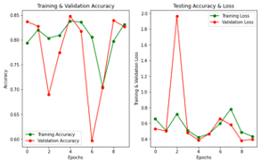
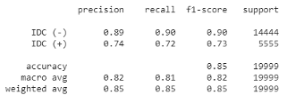
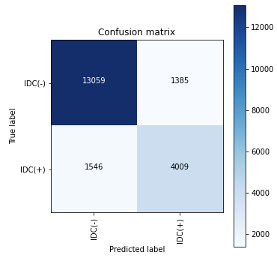

# Carcinoma Classification

## Project Overview
Invasive Ductal Carcinoma is the most common form of breast cancer, and makes up 80% of the cases. Since it is invasive, the cancer can metastasize entering the blood vessels and traveling to other organs where it may proliferate. Early detectio of Ductal Carcinoma lead to a higher survival rate. The goal of this project is to create an accurate model that can classify Invasive Ductal Carcinoma in images of histopathology slides. While pathologists are the ones that classify IDC(-) or IDC(+) from images, their predictions can vary from one expert to the next. If we can create an accurate model, it can provide consistency in diagnosis.

## The Approach
- Download data from Kaggle

- Explore data

- Run baseline model

- Fixed class imbalance

- Adjusted and tuned model for optimal results

- Reviewed model results

## The Model
We started by creating training, testing, and validations sets. Next, our team tested a baseline CNN model and used both the accuracy and f1 metric to judge the abilities of our model. After reviewing the results of our model we searched for additional histology images and used data augmentation techniques to solve our class imbalance. Once we solved the issue of class imbalance, we went through the process of tuning our model until we found the best model. The results of our best model were 77% Accuracy and 78% F1-score. We then tried some model transfer learning techniques, and achieved our best Accuracy (85%) and F1 score (85%) with the Inception model. We are excited to say that we have seen progress from our baseline model and look forward to creating an even more robust model.

## The Front End
The front end website for this project was created through Flask. The requirements needed to run this locally is in the requirements.txt file.

`python application.py`

## The Future 
Though we were able to improve our F1 and our Accuracy score we did not achieve a high one. We will keep working to find the best parameters to tune our model. In addition to the Inception transfer model that was used on this project, we will use other transfer learning models. Lastly, we hope to fix the problem with most histology images of not being clear by using SRGAN and other techniques.
